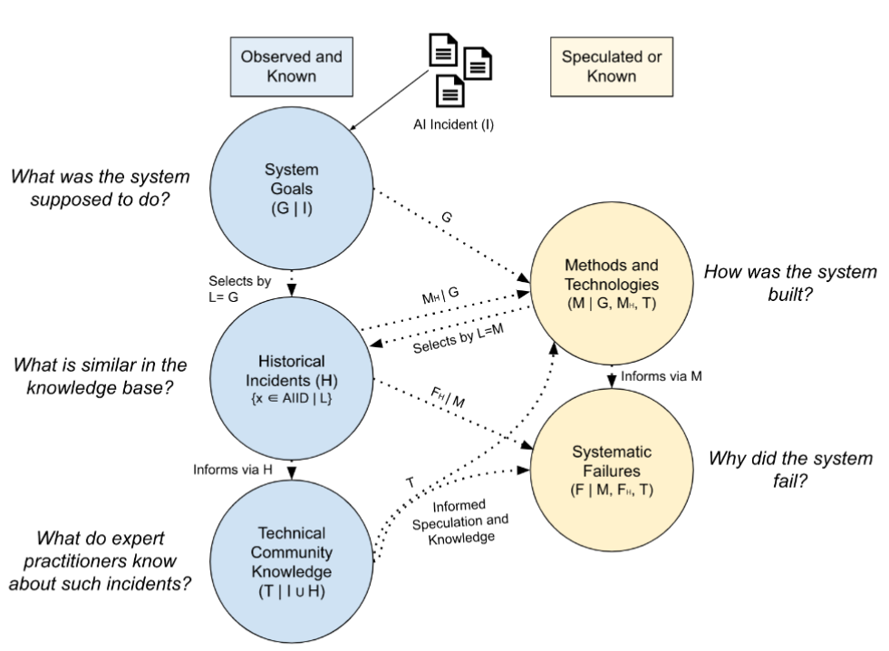
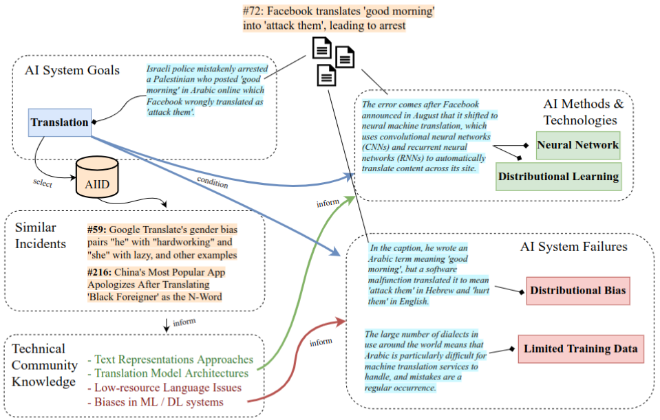

## What is the GMF Taxonomy?

The Goals, Methods, and Failures (GMF) taxonomy is a failure 
cause analysis taxonomy interrelating the goals of the system 
deployment, the system's methods, and their likely technical failings. 

Details on the taxonomy description, proposed annotation process
and future work are available in our [SafeAI 2023 workshop paper](https://ceur-ws.org/Vol-3381/17.pdf), while
a short description is provided below. 

### GMF Motivation and Structure
The GMF taxonomy was developed to address the following use cases and questions:

- How can owners and developers of AI systems discover technical failure causes
of **harm related to the system task**, that the AI is deployed to perform in the real world?

- How can AI developers and engineers discover **technical causal factors of harm**
that may be linked to implementation methods, model architectures and techniques
employed in their system, such that they may be corrected or avoided?

- How can we **leverage the body of expert technical knowledge** from the Machine
 Learning, AI Safety, Engineering, etc. community, to produce useful, high-quality
  annotations on **publicly available AI incident reports**?

- How can we generate annotations **grounded to real-world data** for high-level accuracy,
verifiability and potential for further research and development?

<!-- #### Structure -->
The taxonomy is designed to address the questions above via a structure of three interrelated
 ontologies, each describing the AI system involved in a reported incident under a different lens.
 These ontologies include system views focused on:

- **AI System Goals**, which characterize high-level goals, objectives and tasks of AI systems (e.g. `Face Recognition`)
- **AI Methods and Technologies**, which describe the AI implementation methodologies (e.g. `Transformer`)
- **AI failure causes**, containing technical reasons for systemic failure that results in the observed harm (e.g. `Concept Drift`)

Given that AI incident reports in news media often lack technical details, GMF annotations are paired with:

- **Confidence modifiers** (`known` and `potential`), corresponding to how certain the annotator is,
when applying a label to the incident
- **Text samples** from reports describing the incident, which ground each assigned label to text passages that support the classification
- **Free comments**, where the annotator may provide their rationale, evidence, sources, etc. for the assigned label

## How do I annotate incidents with GMF?

The structure of GMF, paired with the AIID interfaces for [incident discovery](https://incidentdatabase.ai/apps/discover) and annotation editing [^1]<!-- and risk checklisting [^2] -->, exposes the user to multiple sources of useful data for efficient and informed incident annotation. 

For example, the user can retrieve similar incidents annotated by the community with respect to
existing classifications, e.g. regarding the goal of the AI system. Retrieved incidents expose past annotations and auxiliary metadata, such as exemplar text snippets, annotator rationale and
related sourced materials of potential relevance. 

These supplemental data may counteract the lack of AI system implementation details in incident
 reports regarding methods, technologies and technical failure causes, allowing the application of
  fitting labels for the incident at hand.

[^1]: Found in the page for each incident, e.g. [AIID incident #72](https://incidentdatabase.ai/cite/72/)

A visualization of this flow of information for decision making in the annotation process is illustrated  below:

Additionally, an indicative application of this annotation process for the real-world [AIID incident #72](https://incidentdatabase.ai/cite/72/) is illustrated below.

## How do I explore the taxonomy?

All taxonomies can be used to filter incident reports within the 
[Discover Application](https://incidentdatabase.ai/apps/discover). The taxonomy filters work similarly to how 
you filter products on an E-commerce website. Use the search 
field at the bottom of the “Classifications” tab to find the 
taxonomy field you would like to filter with, then click the 
desired value to apply the filter.

## About the Responsible AI Collaborative

The AI Incident Database is a collaborative project of many 
people and organizations. Details on the people and organizations 
contributing to this particular taxonomy will appear here, while 
you can learn more about the Collab itself on the incident 
database [home](https://incidentdatabase.ai/) and 
[about](https://incidentdatabase.ai/about/) pages.

The maintainer(s) of this taxonomy include:
* [Nikiforos Pittaras](https://www.linkedin.com/in/nikiforos-pittaras/)

Contributor(s) of the taxonomy include:
* [Sean McGregor](https://www.linkedin.com/in/seanbmcgregor/)