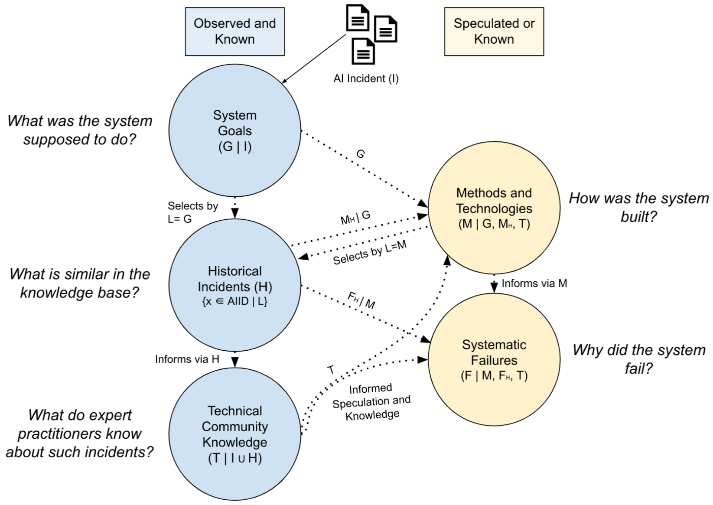

## What is the GMF Taxonomy?

The Goals, Methods, and Failures (GMF) taxonomy is a failure 
cause analysis taxonomy interrelating the goals of the system 
deployment, the system's methods, and their likely failings. 
Details on the process are available in the recent work published 
for [SafeAI paper](https://arxiv.org/abs/2211.07280).

#### Motivation
The taxonomy was developed to address the following use cases and questions:

- How can owners and developers of AI systems discover failures causes related to the real-world task the system is deployed to perform?

- How can developers and engineers discover causal factors of a technical nature, which are linked to specific AI technologies, implementation methods and model architectures, and may lead to the system generating real-world harm?

- How can we leverage the body of expert technical knowledge from the Machine Learning, AI Safety, Engineering, etc. community, to produce useful high-quality annotations on publicly available AI incident reports?

- How can we generate annotations grounded to real-world data for high-level accuracy, verifiability and potential for further research and development?

#### Structure
The taxonomy is composed of three interrelated ontologies, each describing the AI system involved in a reported incident under a different lens. These include:

- AI system goals, which characterize high-level goals, objectives and tasks of AI systems (e.g. `Face Recognition`)
- AI methods and technologies, which describe the implementation of the AI system (e.g. `Transformer`)
- AI failure causes, which contains technical reasons related to systemic failure that may have produced the harm (e.g. `Concept Drift`)

Given that AI incident reports in news media often lack technical details, GMF annotations are paired with:

- confidence modifiers `known` and `potential`, corresponding to annotator high or lesser certainty for a given label.
- text snippets from reports describing the incident, grounding the label to relevant text
- annotator comments, providing rationale, evidence, sources, etc. for the applied label

#### Incident annotation with GMF

The structure of GMF, the incident discovery and the annotation editor interfaces exposes the annotator to different sources of useful information for efficient incident annotation, other than the contents of its reports. That is, the user can retrieve similar, community-annotated incidents, with respect to existing classifications (e.g. the system goal). This exposes past annotations (including exemplar text snippets, rationale and relevant material) to the user, informing the selection of additional appropriate labels for the incident (e.g. methods, technologies and failure causes).

A visualization of this information flow is below:

An indicative annotation process for [AIID incident #72](https://incidentdatabase.ai/cite/72/) is illustrated below.

## How do I explore the taxonomy?

All taxonomies can be used to filter incident reports within the 
Discover Application. The taxonomy filters work similarly to how 
you filter products on an E-commerce website. Use the search 
field at the bottom of the “Classifications” tab to find the 
taxonomy field you would like to filter with, then click the 
desired value to apply the filter.

## About the Responsible AI Collaborative

The AI Incident Database is a collaborative project of many 
people and organizations. Details on the people and organizations 
contributing to this particular taxonomy will appear here, while 
you can learn more about the Collab itself on the incident 
database [home](https://incidentdatabase.ai/) and 
[about](https://incidentdatabase.ai/about/) pages.

The maintainers of this taxonomy include:
* [Nikiforos Pittaras](https://www.linkedin.com/in/nikiforos-pittaras/)

Contributors of the taxonomy include:
* [Sean McGregor](https://www.linkedin.com/in/seanbmcgregor/)